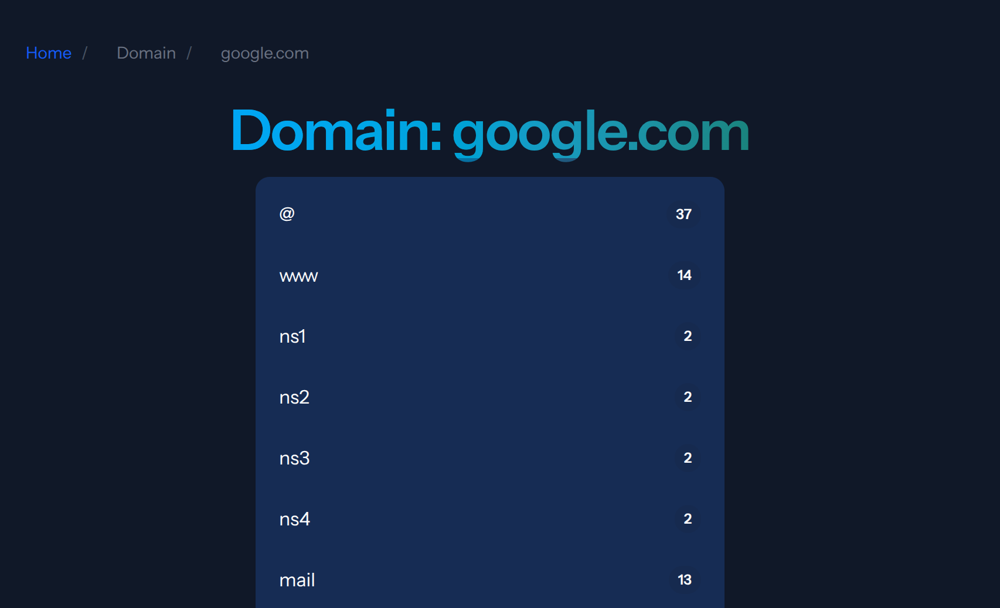

# Domain History


Collects DNS records that can be analysed and reviewed over time. Uses [HarvesterPHP](https://github.com/danwats/HarvesterPHP) for the collection of records and stores them into a database.

This is in early alpha. A lot may change throughout.


## 
- [**Installation**](#installation)
    - [Dev](#dev)
    - [Production](#production)

- [**Usage**](#Usage)
    - [Scan domain](#scan-domain)
- [**Project State**](#project-state)
    - [Images](#images)

## Installation

### Dev

```
cp .env.example .env
docker compose build
docker compose up -d
docker compose exec php-cli php artisan key:generate
# run this again to get php-apache running
docker compose up -d
```

### Production
TBC


## Usage
### Scan Domain
Run the following to scan a domain
```
docker compose exec php-cli php artisan app:record-collector <domain>
```

## Project State
Basic usage works this includes

Frontend:
- Search domains
- go through records and types with pagination

Backend:
- add domain in for collection
- schedule domain scanning, will add a job, and will reschedule itself for scan (partial working)

### Images



TBC
